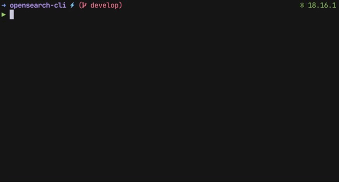

<div align="center">
  <p>
    <a href="https://opensearch.org/" target="blank">
      
    </a>
    <b></b>
    <a href="https://nestjs.com/" target="blank">
      
    </a>
  </p>
  <p>
    <a href="https://opensearch.org/" target="blank">OpenSearch</a> CLI built in <a href="https://github.com/nestjs/nest" target="blank">Nest</a>,<br>
    a progressive Node.js framework for building efficient and scalable server-side applications.
  </p>
  <p>
    <a href="https://www.npmjs.com/@andreafspeziale/os-cli" target="_blank"></a>
    <a href="https://www.npmjs.com/@andreafspeziale/os-cli" target="_blank"></a>
    <a href="https://github.com/andreafspeziale/os-cli/actions" target="_blank"></a>
  <p>
</div>

## Installation
> The Official [opensearch-cli](https://opensearch.org/docs/latest/tools/cli/) is also available

### npm

```sh
npm install -g @andreafspeziale/os-cli
```

### yarn

```sh
yarn global add @andreafspeziale/os-cli
```

### pnpm

```sh
pnpm add -g @andreafspeziale/os-cli
```

### docker

```sh
docker pull andreafspeziale/os-cli
docker run --rm --env-file .env andreafspeziale/os-cli
```

## How to use?



### Quickstart

To taste the CLI very quickly using `npx` or after installing it you can spawn OpenSearch locally by using the `docker-compose` file included in the repository:

- `git clone git@github.com:andreafspeziale/os-cli.git`
- `cd os-cli`
- `docker compose up -d`
- `export OS_CONNECTION_METHOD=localOrProxy`
- `npx @andreafspeziale/os-cli i l` or `os-cli i l`

Like the `docker-compose` file there are also some recipes included in the repository:

- `npx @andreafspeziale/os-cli i cr -i test -f ./recipes/create-index.json` or `os-cli i cr -i test -f ./recipes/create-index.json`

### Configuration

The CLI leverages environment variables in order to set connection and logging options just once.

| Name                        | Required                                               | Default                 | Description                                    | Values                                                          |
|-----------------------------|--------------------------------------------------------|-------------------------|------------------------------------------------|-----------------------------------------------------------------|
| OS_HOST                     | when `OS_CONNECTION_METHOD` is NOT _localOrProxy_      | `http://localhost:9200` | OpenSearch connection host                     | -                                                               |
| OS_CONNECTION_METHOD        | Yes                                                    | -                       | How you want to connect to OpenSearch          | [`localOrProxy`, `serviceAccount`, `credentials`]               |
| AWS_REGION                  | only when `OS_CONNECTION_METHOD` is NOT _localOrProxy_ | -                       | OpenSearch AWS connection region               | -                                                               |
| AWS_ROLE_ARN                | only when `OS_CONNECTION_METHOD` is _serviceAccount_   | -                       | AWS role ARN for assume role connection        | -                                                               |
| AWS_WEB_IDENTITY_TOKEN_FILE | only when `OS_CONNECTION_METHOD` is _serviceAccount_   | -                       | AWS web identity token file                    | -                                                               |
| AWS_ACCESS_KEY_ID           | only when `OS_CONNECTION_METHOD` is _credentials_      | -                       | AWS access key id for canonical connection     | -                                                               |
| AWS_SECRET_ACCESS_KEY       | only when `OS_CONNECTION_METHOD` is _credentials_      | -                       | AWS secret access key for canonical connection | -                                                               |
| LOGGER_LEVEL                | No                                                     | `info`                  | Which logs will be displayed                   | [`silent`, `error`, `warn`, `info`, `http`, `verbose`, `debug`] |
| LOGGER_PRETTY               | No                                                     | `true`                  | Boolean to enable/disable logs formatting      | `true`, `false`                                                 |
| LOGGER_REDACT               | No                                                     | `''`                    | Removed specified words from logs              | -                                                               |

For a docker local OpenSearch instance all you need to do is:

`export OS_CONNECTION_METHOD=localOrProxy`

Instead for a canonical AWS connection method a receipt along with your values would be:

```
export OS_HOST=
export OS_CONNECTION_METHOD=credentials
export AWS_REGION=
export AWS_ACCESS_KEY_ID=
export AWS_SECRET_ACCESS_KEY=
```

## Development

After cloning the repository:

- `cd os-cli`
- `cp ./env/.env.development ./env`
- `docker compose up -d`
- `pnpm install`

I personally prefer build in a terminal window and run the compiled version in a separate one like so:

- `pnpm build --watch`
- `pnpm start:prod` or `node dist/os-cli.js`

## Stay in touch

- Author - [Andrea Francesco Speziale](https://twitter.com/andreafspeziale)
- Website - [https://nestjs.com](https://nestjs.com/)
- Twitter - [@nestframework](https://twitter.com/nestframework)

## License

os-cli [MIT licensed](LICENSE).

